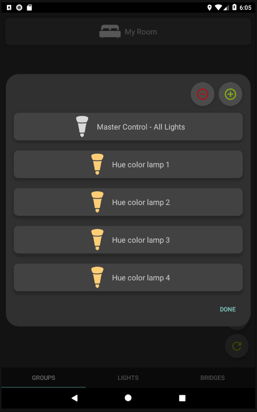

# Android Hue Light Control

This Android Hue Light Control project was created to control devices in a Philips Hue Light system. The app connects to the Hue system through the bridge and controls the devices that are part of the system. The app supports bridge discovery, light discovery, group discovery and management of lights/groups. 

  
# Bridge View

The bridge view is powered by 
[bridgesFragment.java](https://github.com/DAVRUS06/Android_Hue_Light_Control/blob/master/app/src/main/java/com/example/user/finalhcproject/bridgesFragment.java), [BridgeAdapter.java](https://github.com/DAVRUS06/Android_Hue_Light_Control/blob/master/app/src/main/java/com/example/user/finalhcproject/BridgeAdapter.java) and [ListItemBridge.java](https://github.com/DAVRUS06/Android_Hue_Light_Control/blob/master/app/src/main/java/com/example/user/finalhcproject/ListItemBridge.java). The bridgesFragment class uses two different methods of finding the bridges on the network. The first is the findBridges() method that uses the nupnp method of finding bridges on the network. This works by creating a request to a Philips server to receive a list of bridges that are associated with the public ip address of the current network. Then shows a list of the discovered bridges in the bridge view. This method works for networks that the bridge has been a part of long enough to have already pinged the Philips server and associate itself. The next method of finding bridges is the HuebridgeDiscovery() which is a Hue SDK supplied method of finding the bridges. This method scans the network for bridges by looking for the response a bridge would respond with. It is more reliable than the nupnp method but it tends to crash the Android Studio Emulator so it should only be used on the device and the nupnp method should be used in the emulator. The BridgeAdapter will bind all found bridges to buttons that can be interacted with on screen. 
  
##### Figure 1: Bridge View

  
# Lights View

The lights view is powered by the [LightsFragment.java](https://github.com/DAVRUS06/Android_Hue_Light_Control/blob/master/app/src/main/java/com/example/user/finalhcproject/LightsFragment.java), [LightAdapter.java](https://github.com/DAVRUS06/Android_Hue_Light_Control/blob/master/app/src/main/java/com/example/user/finalhcproject/LightAdapter.java) and [hueColorConversion.java](https://github.com/DAVRUS06/Android_Hue_Light_Control/blob/master/app/src/main/java/com/example/user/finalhcproject/hueColorConversion.java). The LightsFragment class is responsible for finding the lights that are in the system by getting the data from the bridge cache. It starts by forcing an update of the bridge cache then pulling the light data from it. Then it will call the lightAdapter to bind all found devices to buttons that can be interacted with on screen. As can be seen in the image below in figure 2. 
  
##### Figure 2: Light List View

In this view the user can choose to interact with lights individually or select the master light control to control them all at once. When a light is tapped on the light editing controls will appear as shown below in figure 3.
  
##### Figure 3: Light Edit View

This allows the user to edit the name, color, saturation and brightness of the light. Color loop is a feature where the light will cycle through the color spectrum automatically and identify will pulse the light when tapped on to know which physical light the user is editing. Then the final option is to turn the light on or off. 

The hueColorConversion class uses the XY to RGB value conversion for converting the color values into easier to use values for the color selection seekbars. 

  
# Groups View

The groups view is powered by [GroupsFragment.java](https://github.com/DAVRUS06/Android_Hue_Light_Control/blob/master/app/src/main/java/com/example/user/finalhcproject/GroupsFragment.java), [GroupsAdapter.java](https://github.com/DAVRUS06/Android_Hue_Light_Control/blob/master/app/src/main/java/com/example/user/finalhcproject/GroupsAdapter.java) and [GroupLightAdapter.java](https://github.com/DAVRUS06/Android_Hue_Light_Control/blob/master/app/src/main/java/com/example/user/finalhcproject/GroupLightAdapter.java). When started the GroupsFragment will gather information from the bridge cache in order to find the groups in the system. Then those groups will be passed to the GroupsAdapter where they will be bound to buttons on the screen for interation. Figure 4 below shows the result of this process.
  
##### Figure 4: Groups View

When the user taps on a group that is in the list then the GroupsFragment class will find the lights for that group and then pass those to the GroupLightAdapter class to bind to buttons for interaction. This is shown in figure 5.
  
##### Figure 5: Groups Light View

At this point the app will handle the lights the same way that they were handled in the LightsFragment class and give the same edit options as shown before. The + and - icons give the user the ability to add or remove a light from the group. Tapping will bring up controls from editing the light in the group as shown in figure 6. 
  
##### Figure 6: Group Add/Remove Light

Checking the box will include the light with the group and unchecking the box will remove the light from the group.

  
##### Figure 7: Groups View

The three buttons on the bottom right of figure 7 are for adding/removing a group from the system and updating the group list. When the refresh button is tapped the class will look for any new group data from the bridge cache. Tapping the + icon will bring up the bridge creation controls as shown in figure 8. The user chooses a name for the group and which lights should be associated with the new group. 

  
##### Figure 8: Groups Add Group

Tapping the - icon will bring up the control for removing a group as shown in figure 9. All groups will be shown and checking the box next to a group name will remove it from the system. 
  
##### Figure 9: Groups Remove Group
